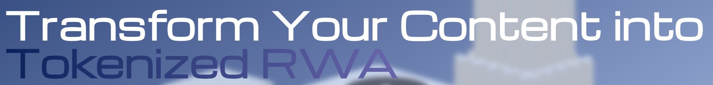

# Introduction

!!! :zap: Getting Started :zap:
We recommend you to read our whitepaper and learn more about our mission, vission and features. The whitepaper will be updated regularly.
!!!

The rise of the creator economy marks a pivotal shift in how individuals monetize their passions, skills, and intellectual property. With over 50 million creators globally contributing to a market projected to exceed $250 billion by 2027, the demand for innovative and scalable financial tools has never been higher. However, most creators remain constrained by outdated monetization models that fail to meet their evolving needs.

## Challenges Facing Creators

 Traditional platforms like YouTube, Instagram, and Twitch rely heavily on ad-based revenue models, tipping, and subscriptions. While these methods generate income, they come with significant limitations:

1. **Revenue Dependency:** Creators often depend on platform algorithms, making earnings unpredictable.
2. **High Platform Fees:** Up to 45% of creator earnings can be taken as fees, leaving minimal returns for their efforts.
3. **Limited Fan Participation:** Fans are confined to passive roles, unable to actively engage in or benefit from creators’ success.
4. **Access to Capital:** Securing funding for large-scale projects remains a challenge, as creators lack the infrastructure to leverage their real-world assets (RWAs).

## Our Vision

 We are introducing a blockchain-powered payment infrastructure ecosystem designed to empower creators by addressing these challenges head-on. By leveraging the power of blockchain technology, our platform enables creators to tokenize their real-world assets, engage fans as stakeholders, and unlock new avenues for revenue generation.

## How It Works

1. **Tokenization of Real-World Assets (RWAs):** Creators can fractionalize assets like properties, royalties, or intellectual property into digital tokens, making them accessible to fans and investors.
2. **Smart Contracts for Revenue Sharing:** Blockchain ensures automated, secure, and transparent distribution of revenue to token holders.
3. **Fan Participation and Co-Ownership:** Fans move beyond passive support, becoming active participants in creators' journeys by investing in their tokenized assets.

### Key Benefits

**For Creators:**

1. Monetize assets without relinquishing full ownership.
2. Diversify income streams beyond traditional ads and tips.
3. Build stronger, more engaged communities by involving fans as co-investors.

**For Fans:**

1. Gain a tangible stake in creators’ projects and success.
2. Earn passive income from royalties or asset appreciation.
3. Participate in exclusive opportunities and decision-making processes.

### Why Now?

The adoption of blockchain technology and the growing interest in decentralized finance (DeFi) have created a perfect storm of opportunity. Creators are looking for ways to regain control over their monetization, while fans are eager to deepen their connection with creators. This platform bridges the gap, creating a win-win scenario for both.

### Our Commitment

 We aim to revolutionize the creator economy by offering a secure, scalable, and accessible platform that empowers creators and fans alike. By turning creators into entrepreneurs and fans into stakeholders, we’re building a future where creativity knows no financial bounds.
