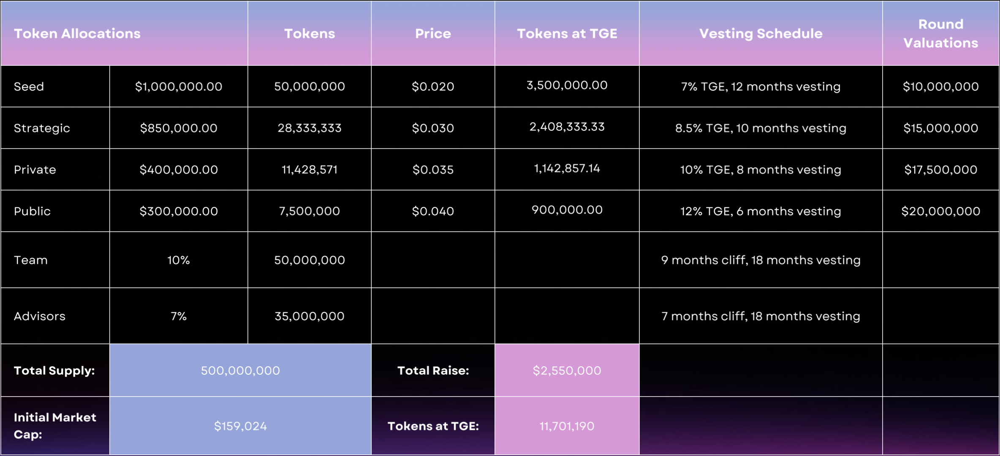

# Tokenomics

The tokenomics of our platform is designed to create a sustainable and engaging ecosystem for creators, fans, and investors. The native token powers the platform, incentivizes participation, and drives long-term growth by balancing supply, demand, and rewards.

## 1. Token Supply and Allocation

The total supply of tokens is capped to ensure scarcity and value appreciation over time. The initial allocation is strategically distributed to support platform development, incentivize early adopters, and ensure long-term sustainability.

||| Category

- Product Development

- Marketing

- Partnerships

- Operations

||| Allocation (%)

- 40%

- 30%

- 20%

- 10%

||| Purpose

- For infrastructure and feature expansion.
- To onboard creators and fans.
- For integrations and collaborations.
- For scaling the team.
|||

### Long-Term Value Strategy

- **Sustainable Supply:** Scarcity is maintained through burning and staking, ensuring token value appreciates over time.
- **Incentivized Adoption:** Fans and creators are rewarded for participation, driving token demand.
- **Broad Utility:** With a wide range of use cases, tokens remain integral to every aspect of the platform.

This tokenomics model ensures a balanced, sustainable ecosystem that incentivizes users, drives growth, and enhances the long-term value of the platform.
